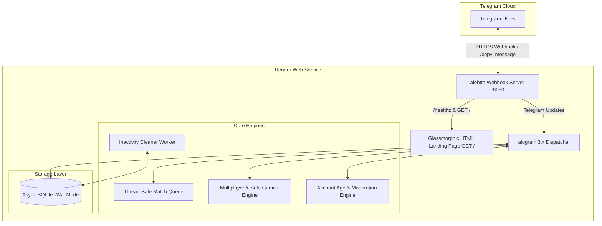

# 🎭 Stranger Chat Bot

[](https://www.python.org/)
[](https://docs.aiogram.dev/)
[](https://github.com/omnilib/aiosqlite)
[](https://render.com/)
[](https://opensource.org/licenses/MIT)

A high-performance, asynchronous Telegram bot built with **Python 3.10+**, **aiogram 3.x**, **aiohttp**, and **aiosqlite**. Connects strangers worldwide for **100% anonymous**, **End-to-End Encrypted**, safe, and real-time conversations.

---

## 🌟 Architecture Overview



---

## ✨ Key Features

### 1. 🔐 100% End-to-End Encrypted & Anonymous
- **Zero Profile Exposure**: Names, Telegram IDs, usernames, and phone numbers are never shared with partners.
- **Headerless Relaying**: All messages and multimedia (photos, voice notes, video notes, stickers, documents, animations) are forwarded using Telegram’s native `copy_message` without forward tags.
- **Strict Privacy Guarantees**: Highlighted across all touchpoints (SEO meta tags, `/start` welcome card, match banners, and command guides) confirming that conversations are completely private and confidential.

### 2. 👫 Smart Matchmaking Engine
- **Gender-Based Pairing**: Users choose **Male 👨**, **Female 👩**, or **Prefer not to say 🎭**. The system prioritizes matching with opposite genders, with seamless fallback to any waiting stranger if a preference is unavailable.
- **Age Bracket Preferences**: Choose from **Below 18 🐣**, **18–25 ✨**, **25–35 💼**, and **40+ 🌟**. Connected partner badges show age bracket and gender upon match.
- **⭐ VIP Priority Queue**: Premium users bypass regular queues with prioritized matchmaking.
- **Thread-Safe Virtual Queue**: Lock-protected async queue (`match_queue.py`) prevents race conditions, ghost pairings, or double-matches.

### 3. ⏱️ Smart Chat Disconnect & Confirmation Flow
- **Under 10 Seconds (`< 10s`) Instant Skip**: If a user taps `⏭️ Next` or `⏹️ End` within 10 seconds of connecting, **no confirmation is required**—the bot immediately disconnects and finds a new stranger in **one tap**.
- **10 Seconds or More (`≥ 10s`) Confirmation**: For active chats lasting 10+ seconds, the bot prompts for confirmation and displays the conversation's exact duration:
  ```
  ⚠️ Disconnect and find next partner?
  ⏱️ Chat Duration: 2m 14s
  Are you sure you want to end this conversation?
  [⏭️ Yes, Next Partner]  [💬 Keep Chatting]
  ```
- **Duration Timing for All**: Upon disconnect (manual end, skip, or inactivity timeout), both participants receive the total chat duration accompanied by a bold, highlighted motivational quote and quick-action buttons (`[🔍 Find Next]`, `[👤 Profile]`).

### 4. 🎮 Multiplayer Partner Duels & Solo Mini-Games
Interactive real-time games playable both solo and live with connected strangers:
- **🎯 Turn-Based Number Guess Duel (`0–9`)**:
  - Starter takes Attempt #1 with a `[0–9]` keypad.
  - Partner sees a live waiting card (`⏳ Partner's Turn...`).
  - Wrong guesses immediately pass the turn and keypad to the partner with directional clues (**HIGHER ⬆️** or **LOWER ⬇️**).
  - The first player to crack the number wins with the fewest attempts!
  - In-place message edits provide a responsive mobile experience without chat spam.
- **⚡ Math Speed Duel**: Arithmetic speed problems ($+, -, \times, \div$) with millisecond reaction timers.
- **✊ Rock-Paper-Scissors Showdown**: Secret move locking with simultaneous reveal and animated clash descriptions.
- **🎲 Lucky Dice Duel & 3D Physics Dice**: Human-vs-human dice rolls and authentic 3D Telegram animated dice.
- **🏆 Persistent Session Scoreboard**: Tracks cumulative score (`You 2 — 1 Partner`) across all duels within the session.
- **🚫 Zero Modal Popups**: All callback queries acknowledge silently—no intrusive dialog boxes with "OK" buttons.

### 5. 🎲 Icebreakers & Conversation Starters
- 40+ curated, thought-provoking questions across lighthearted, deep, and creative themes.
- Delivered in clean, natural question format into chat without distracting borders or dividers.

### 6. 💬 Real-Time Typing & Uploading Action Indicators
- Transmits native Telegram chat actions (`typing`, `upload_photo`, `upload_video`, `record_voice`, `upload_document`, `choose_sticker`) directly to your partner so you always know when they are responding.

### 7. 🌐 Preferred Language Matching (Optional)
- Select your preferred chat language (`English`, `Hindi`, `Hinglish`, `Spanish`, `Russian`, `Arabic`, or `Any`).
- Matchmaking prioritizes same-language partners with automatic, zero-delay fallback so no user is ever left waiting. Completely optional—users can search freely without setting a language.

### 8. 👁️ Media Blur & Spoiler Protection
- One-tap toggle (`/spoiler`) applies Telegram's native tap-to-reveal blur to photos, videos, and animations. Protects users from accidental NSFW exposure and ensures safe browsing in public spaces.

### 9. 📢 Admin Broadcast Engine
- Secure admin-only broadcast engine (`/broadcast`) capable of dispatching announcements or forwarded rich media to all registered non-banned users. Includes automatic Telegram rate limiting (~28 msgs/sec), retry-after protection, and real-time delivery performance metrics.

### 10. 🛡️ Trust, Safety & Community Moderation
- **Account Age Estimator**: Validates account registration date against Telegram user ID checkpoints (`account_age.py`). Accounts younger than 30 days are automatically restricted from matchmaking to block disposable spam bots.
- **Reason-Based Reporting**: Reporting prompts users with structured categories (`Inappropriate / NSFW`, `Harassment`, `Spam`, `Creepy Behavior`, `Other`).
- **Automated 3-Strike Ban**: Auto-bans malicious accounts upon reaching 3 moderation strikes.

### 11. 📱 Sleek, Minimal Mobile UX
- **No Heavy Dividers**: Zero box-drawing characters (`━`); clean typography with standard line breaks.
- **Compact Reply Keyboards**:
  - **Idle Mode**: 3 rows (`[🔍 Find Stranger]`, `[🎮 Games] [🎲 Icebreaker]`, `[👤 Profile] [❓ Help]`).
  - **Active Chat Mode**: 2 rows (`[⏭️ Next] [⏹️ End]`, `[🎲 Icebreaker] [🎮 Game] [🚨 Report]`).
  - Maximizes vertical screen real estate for reading chat messages on smartphones.

### 12. 🌐 Built-in SEO & Web Landing Page
- Dark-mode glassmorphic HTML landing page served on `GET /` with OpenGraph meta tags, feature cards, and direct Telegram deep-links.
- Automatically synchronizes Telegram Bot SEO descriptions (`set_my_description`, `set_my_short_description`) on startup for maximum discovery in Telegram search.

---

## 🛠️ Tech Stack

| Component | Technology | Purpose |
|---|---|---|
| **Language** | Python 3.10+ | Clean async/await syntax and dataclasses |
| **Framework** | `aiogram 3.x` | Asynchronous Telegram Bot API framework |
| **HTTP Server** | `aiohttp` | Webhook updates & glassmorphic landing page |
| **Database** | `aiosqlite` | Non-blocking async SQLite with WAL mode |
| **Environment** | `python-dotenv` | Twelve-factor configuration management |

---

## 📁 Project Structure

```
TelegramCHATbot/
├── .env.example              # Template environment variables
├── .gitignore                 # Excludes local databases, venv, and caches
├── README.md                  # Detailed project documentation
├── requirements.txt           # Python dependency specifications
├── account_age.py             # Milestone interpolation & account age verification
├── config.py                  # Environment variable loader & settings
├── database.py                # Asynchronous SQLite schema, queries, and migrations
├── games.py                   # Solo & turn-based multiplayer duels logic
├── handlers.py                # Telegram command, message, callback & duel handlers
├── icebreakers.py             # Conversation starter prompt engine
├── inactivity.py              # Background worker for 10-minute session expiration
├── keyboards.py               # Reply and inline keyboard generators
├── main.py                    # Aiohttp webhook server, SEO landing page & lifecycle
├── match_queue.py             # Thread-safe async matchmaking queue manager
├── quotes.py                  # Motivational quotes, duration formatting & cards
└── data/
    └── id_checkpoints.json    # Telegram ID milestones for account age calculation
```

---

## 🗄️ Database Schema

SQLite with **Write-Ahead Logging (WAL)** mode enabled:

### `users`
| Column | Type | Description |
|---|---|---|
| `tg_id` | `INTEGER PRIMARY KEY` | Telegram numeric user ID |
| `username` | `TEXT` | Telegram username (if available) |
| `gender` | `TEXT` | `male`, `female`, `prefer_not_to_say`, or `unknown` |
| `age_range` | `TEXT` | `below_18`, `18-25`, `25-35`, or `40+` |
| `is_banned` | `INTEGER` | `1` if banned, `0` otherwise |
| `strikes` | `INTEGER` | Number of moderation strikes received |
| `is_premium` | `INTEGER` | `1` if VIP membership active |
| `premium_expiry`| `TEXT` | ISO 8601 timestamp of VIP expiration |
| `account_created_at` | `TEXT` | Estimated Telegram account creation date |
| `chat_count` | `INTEGER` | Total number of chat sessions completed |
| `language` | `TEXT` | Preferred language code (default `'any'`) |
| `media_spoiler` | `INTEGER` | Tap-to-reveal blur toggle (`1` = ON, `0` = OFF) |

### `chat_sessions`
| Column | Type | Description |
|---|---|---|
| `id` | `INTEGER PRIMARY KEY AUTOINCREMENT` | Unique session identifier |
| `user1_id` | `INTEGER` | Telegram ID of participant 1 |
| `user2_id` | `INTEGER` | Telegram ID of participant 2 |
| `started_at` | `TEXT` | ISO 8601 session start timestamp |
| `last_activity_at` | `TEXT` | ISO 8601 timestamp of last forwarded message |

### `reports`
| Column | Type | Description |
|---|---|---|
| `id` | `INTEGER PRIMARY KEY AUTOINCREMENT` | Report ID |
| `reporter_id` | `INTEGER` | Telegram ID of reporting user |
| `reported_id` | `INTEGER` | Telegram ID of reported user |
| `reason` | `TEXT` | Category/reason for report |
| `created_at` | `TEXT` | Timestamp of report submission |

### `premium_codes`
| Column | Type | Description |
|---|---|---|
| `code` | `TEXT PRIMARY KEY` | 4-digit activation code |
| `tg_id` | `INTEGER` | Target Telegram ID for VIP activation |
| `is_used` | `INTEGER` | `1` if redeemed, `0` otherwise |

---

## 🚀 Installation & Local Setup

### 1. Clone the Repository

```bash
git clone https://github.com/yashwantmandal26/stranger-chat-bot.git
cd TelegramCHATbot
```

### 2. Create and Activate Virtual Environment

```bash
python -m venv venv

# Windows
venv\Scripts\activate

# Linux / macOS
source venv/bin/activate
```

### 3. Install Dependencies

```bash
pip install -r requirements.txt
```

### 4. Configure Environment Variables

Copy the template `.env.example` to `.env`:

```bash
cp .env.example .env
```

Edit `.env` with your credentials:

```ini
BOT_TOKEN=your_telegram_bot_token_from_botfather
ADMIN_ID=your_numeric_telegram_user_id
ADMIN_UPI_ID=your_upi_id@bank
DB_PATH=stranger_chat.db
MIN_ACCOUNT_AGE_DAYS=30
WEBHOOK_URL=https://your-domain-or-ngrok.com
PORT=8080
```

> **Local Webhook Testing**: Use [ngrok](https://ngrok.com/) to expose port 8080:  
> `ngrok http 8080`  
> Set `WEBHOOK_URL=https://<your-subdomain>.ngrok-free.app` in your `.env`.

### 5. Launch the Application

```bash
python main.py
```

The bot will initialize the database, start the background inactivity cleaner, register SEO metadata with Telegram, start the web server on `http://0.0.0.0:8080`, and register the webhook.

---

## ☁️ Deployment on Render (Free Web Service)

Render Web Services provide automatic HTTPS, custom domains, and zero-downtime deploys:

1. Push your code to your GitHub repository (`https://github.com/yashwantmandal26/stranger-chat-bot`).
2. Log into [Render Dashboard](https://dashboard.render.com/) and click **New +** > **Web Service**.
3. Select your repository.
4. Set the following build options:
   - **Environment**: `Python 3`
   - **Build Command**: `pip install -r requirements.txt`
   - **Start Command**: `python main.py`
5. Configure Environment Variables under **Environment**:
   - `BOT_TOKEN`: `your_telegram_bot_token`
   - `ADMIN_ID`: `your_numeric_telegram_id`
   - `WEBHOOK_URL`: `https://your-service-name.onrender.com`
   - `PORT`: `8080`
6. Click **Create Web Service**.
7. Render automatically provisions the container, validates `GET /`, and registers the webhook with Telegram.

### 6. Keeping the Instance Warm (Preventing 15-Min Free-Tier Sleep)

Render's Free Web Services spin down into sleep mode after 15 minutes of inactivity, causing incoming Telegram messages to endure a 30–60 second cold-start wake-up delay.

To ensure **instant 24/7 message delivery**, the application provides dual-layer keep-alive mechanisms:

1. **Automatic Internal Keep-Alive Worker**:
   - The bot automatically spawns an asynchronous background worker (`run_keep_alive_worker`) that pings its own public URL (`GET /healthz`) every 12 minutes.
   - Because this request traverses Render's external HTTPS load balancer, Render resets its 15-minute inactivity timer from within the container.

2. **External Uptime Monitor (Recommended Redundancy)**:
   - Configure a free monitor using [UptimeRobot](https://uptimerobot.com/) or [cron-job.org](https://cron-job.org/):
     - **Monitor Type**: `HTTP(s)`
     - **Friendly Name**: `Stranger Chat Bot`
     - **URL**: `https://<your-service-name>.onrender.com/healthz`
     - **Monitoring Interval**: `Every 10 minutes` (or `Every 12 minutes`)
     - **Expected HTTP Code**: `200 OK`
   - Both `/healthz` (JSON with uptime stats) and `/ping` (raw `pong`) return in `<1ms`, keeping memory and CPU footprint near zero.

---

## 🤖 Command & Button Reference

| Command | Quick Button | Scope | Description |
|---|---|---|---|
| `/start` | — | Any | Main welcome card, profile summary & setup |
| `/find` | `🔍 Find Stranger` | Idle | Search for a partner (opposite gender prioritized) |
| `/next` | `⏭️ Next` | Active Chat | Skip partner (<10s instant, ≥10s asks confirmation) |
| `/stop` | `⏹️ End` | Active Chat / Queue | End chat (<10s instant, ≥10s asks confirmation) or cancel search |
| `/games` | `🎮 Game` | Any | Play Guess Number (0–9), Math, RPS, Dice (Solo & Duels) |
| `/icebreaker` | `🎲 Icebreaker` | Active Chat | Sends engaging question directly into conversation |
| `/profile` | `👤 Profile` | Any | Displays anonymous profile card and stats |
| `/gender` | Inline Button | Any | View or update gender preference |
| `/age` | Inline Button | Any | View or update age bracket |
| `/language` | Inline Button | Any | Choose preferred chat language (Optional) |
| `/spoiler` | Inline Button | Any | Toggle tap-to-reveal blur on photos & videos |
| `/report` | `🚨 Report` | Active Chat | Report partner with category reason (auto-ban on 3 strikes) |
| `/invite` | — | Any | One-tap Telegram share button |
| `/help` | `❓ Help` | Any | Command guide, etiquette & encryption guarantee |
| `/stats` | — | Admin only | Live analytics, queue size, and active user metrics |
| `/broadcast` | — | Admin only | Broadcast announcement or media to all users with rate limiting |

---

## 🔒 Security & Privacy Practices

1. **No Data Retention of Chat Logs**: Message payloads are relayed in real-time between Webhooks via `copy_message` in memory. No message texts, photos, or media files are stored on disk or in the database.
2. **SQL Injection Prevention**: 100% of SQLite database queries use parameterized SQL queries (`?` parameter substitutions).
3. **Graceful Webhook Cold-Starts**: Startup logic retains pending webhook updates (`drop_pending_updates=False`) so users tapping `/start` while Render spins up are never lost.
4. **Rate Limiting & Anti-Abuse**: Rapid-fire `/next` button spam is rate-checked, and young disposable bot accounts (<30 days) are screened out.

---

## 📄 License

This project is open-source software licensed under the **[MIT License](LICENSE)**. Free for personal, academic, and commercial use.
